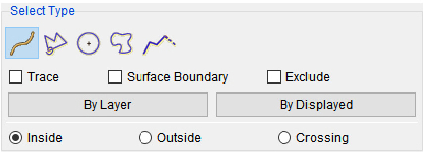
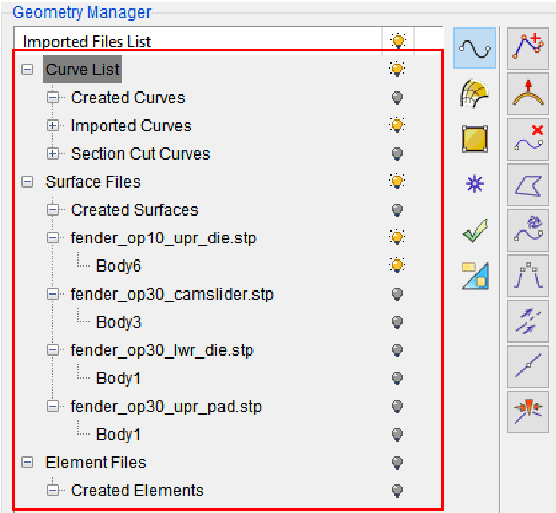

# CHAPTER 1 STRUCTURAL OVERVIEW

eta/DYNAFORM is a completely new Graphic User Interface (GUI) package operating on Windows (10 and higher) platform. The model generation and input file preparation of a typical stamping simulation are performed in the eta/DYNAFORM Geometry Manager, while the stamping simulation result is processed in Result. The solver, LS-DYNA can be executed on either local or remote server systems.

eta/DYNAFORM is organized as a tree structure and is operated and controlled by the user-friendly GUI.

# 1.1 MENU BAR

eta/DYNAFORM menus are selected by mouse picking and contain a wide variety of functions. Under each menu, the user can click on various icons to activate the functions.

<html><body><table><tr><td>Project</td><td>BSE</td><td>DFD</td><td>FS</td><td>。 Data</td><td>Geometry</td><td> View</td><td>国 Utilities </td><td>Result</td><td>Report</td><td>Help</td></tr></table></body></html>

<html><body><table><tr><td>Project</td><td>Imports/exports data to/from eta/DYNAFORM.</td></tr><tr><td>BSE</td><td>Blank Size Engineering includes a modified one-step-based unfolding function, spring back, blank development and nesting function.</td></tr><tr><td>Die Face Design</td><td>The Die Face Design (DFD) module provides abundant tools for fast die surface design, including the binder and addendum design, local feature modification and fast evaluation of die face design, etc. The user can modify the binder and addendum according to the results of evaluation, which significantly speeds up the efficiency of die face design optimization.</td></tr><tr><td>Formability Simulation</td><td>The Formability Simulation module provides a complete set of solutions for problems existed in the sheet forming process.</td></tr><tr><td>Tube Forming</td><td>The Tube Forming module provides a complete set of solutions for tube bending and hydroforming analysis. This module supports users to complete the processes from product import to analysis results, including Tube Bending, Pre-forming, Annealing, Hydroforming, Piercing and Trimming and other processes.</td></tr></table></body></html>

<html><body><table><tr><td>Data Manager</td><td>This application is used to manage simulation data.</td></tr><tr><td>Geometry Manager</td><td>This application is used to manage both imported and created geometry such as curves, surfaces and meshes.</td></tr><tr><td>View</td><td>Controls the visualization of the entities on the screen.</td></tr><tr><td> Utilities</td><td>Includes several auxiliary functions for identifying entities, measurement and load curve generation.</td></tr><tr><td>Result</td><td>Initiates post-processing functions for analyzing formability simulation results.</td></tr><tr><td>Report</td><td>Automatically generates relevant CAE analysis reports, supporting both PPT and Excel modes</td></tr><tr><td>Help</td><td>DisDYNAORisnpumberdOnictifptionand icese maagement for</td></tr></table></body></html>

Descriptions of these functions are located in their respective sections.

# 1.2 ICON BAR

The icon bar is designed to provide the user can easy access to the most commonly used in PROJECT functions of eta/DYNAFORM.

# NEW PROJECT

Creates a new database.

# OPEN PROJECT

Opens a saved database.

# SAVE PROJECT

Saves the active database using its existing name on the existing folder.

# SAVE PROJECT AS

Saves the existing database using another name.

# RELOAD FILE

Reloads the database from the initial saved database.

# 1.3 DISPLAY WINDOW

eta/DYNAFORM divides the screen into six distinct regions. The regions are used to receive functions or display messages for the user.

# DISPLAY AREA

All model graphics are displayed in this area.

# MENU BAR

All functions are accessible through the menu bar. Selectable Icon-based toolbars are used to access and manage all functions.

# ICON BAR

Selectable Icon-based toolbars are used to access and manage Project functions.

# TASK PANEL

Listing of all model entities and creation of non-graphical data entities. Process-driven dialog has an access to complete modeling tasks.

# MODEL TREE

Users may turn on/off generated geometry, tools and curves by mouse clicking on thelight bulbs.

# MESSAGE WINDOW

Results of functions and warning or error messages are printed in this window.

# 1.4 MOUSE FUNCTIONS

eta/DYNAFORM functions are accessible via the three mouse buttons. To access a function, the user moves the mouse cursor to select the desired function, followed by pressing the left mouse button. In certain functions, the middle mouse button is used to complete operations while the right mouse button is used to cancel the last operation, such as creating a line, selecting nodes, surfaces, elements or coordinate system. These three buttons can also be used with ${ \mathrm { < C t r l > } }$ , ${ \mathrm { < A l t > } }$ and ${ \mathrm { < C t r l > + < } }$ Shift> keys respectively for rotation, translation and scaling.

For CAD models, eta/DYNAFORM supports utilizing CATIA, NX and SolidWorks Mouse operations style.   

<html><body><table><tr><td>Control Key+ Mouse Button</td><td>Function</td></tr><tr><td>Ctrl+Left Button</td><td>Rotation</td></tr><tr><td>Ctrl+Shift+ LeftButton</td><td>Rotate Light</td></tr><tr><td>Ctrl+Middle Button</td><td>Translation</td></tr><tr><td>Ctrl+Right Button</td><td>Scaling</td></tr></table></body></html>

<html><body><table><tr><td>Function</td><td>CATIA</td><td>NX</td><td>SolidWorks</td></tr><tr><td>Rotation</td><td>Three Approaches: 1.Press MMB and then RMB. 2.Press MMB and then Ctrl. 3.Press MMB and then LMB.</td><td>Hold MMB and move the mouse button.</td><td>Hold MMB and move the mouse button.</td></tr><tr><td>Translation</td><td>HoldMMB and move the mouse button.</td><td>Two Approaches: 1. Shift+MMB and move the mouse. 2.MMB+RMB.</td><td>Ctrl+MMB</td></tr><tr><td>Scaling</td><td>Ctrl+MMB and move the mouse button.</td><td>Three Approaches: 1. Hold (LMB+MMB) and move the mouse button. 2. Scroll Wheel. 3. Ctrl+MMB and move the mouse button</td><td>Scroll Wheel</td></tr></table></body></html>

eta/DYNAFORM provides options in the Option Center to switch operation styles from Dynaform Style to NX, Catia or SolidWorks styles.

# 1.5 GEOMETRY DATA

eta/DYNAFORM directly reads in IGES, VDA, STEP and eta/DYNAFORM geometry data (lines and surfaces). It also directly reads native CAD data files such as CATIA V4 & V5, Pro/E, NX and SolidWorks.

# 1.6 FILE EXTENSIONS

The protocol for naming files during an eta/DYNAFORM session includes attaching suffixes that specify the file types to the file names. The appropriate file names are listed in the options area of the display screen.

# DYNAFORM Model Files: \*.dfp

Additionally, the following import/export file naming is suggested:

<html><body><table><tr><td colspan="2">CAD Files</td><td colspan="2">CAE Solver Files</td></tr><tr><td>IGS</td><td>*.igs, *.iges</td><td>LS-DYNA</td><td>*.dyn, *.k, *.key, *mod</td></tr><tr><td>ACIS</td><td>*.sat, *.sab</td><td>NASTRAN</td><td>*.nas, *.dat, *.bdf</td></tr></table></body></html>

# 1.7 ENTITY SELECTIONS

In certain functions such as Copy, Delete, etc., eta/DYNAFORM prompts the user to select lines, surfaces elements, nodes, etc. In addition, different entities correspond to different selection boxes. Show/Hide / Button: Click these buttons to show or hide the options for selection.

(a) Display (b) Hide   

<html><body><table><tr><td>CATIA V4</td><td>*.model</td><td>DYNAIN</td><td>*.dynain</td></tr><tr><td>CATIA V5</td><td>*.CATPart, *.CATProduct</td><td></td><td></td></tr><tr><td>Inventor</td><td>*.ipt, *.iam</td><td></td><td></td></tr><tr><td>NX</td><td>*.prt</td><td></td><td></td></tr><tr><td>Parasolid</td><td>*.x_t，*.xmt_txt， *x_b,</td><td></td><td></td></tr><tr><td>Pro/E/Creo</td><td>*.xmt_bin *.prt, *.asm</td><td></td><td></td></tr><tr><td>SolidWorks</td><td>*.sldprt, *.sldasm</td><td></td><td></td></tr><tr><td>STEP</td><td>*.stp,*.step</td><td></td><td></td></tr></table></body></html>

Choose to show or hide the selection box through the Project- $. >$ Option Center- $. >$ Selection- $\cdot >$ Yes/No menu. If No is selected, all selection boxes will be hidden when the dialog is displayed. If Yes is selected, all selection boxes will be displayed.

eta/DYNAFORM incorporates various dialogs to execute functions throughout the program.Buttons at the bottom of the dialogare used to execute, reject, reset the data or close the dialog. The functions of these buttons are listed below.

<html><body><table><tr><td>Undo</td><td>Rejects the last step of the operation</td></tr><tr><td>Redo</td><td>Redoes the last Undo function and return the database to the previous state.</td></tr><tr><td>Apply</td><td>Executes the current function without leaving the dialog.</td></tr><tr><td>OK</td><td>Accepts the data in the dialog and forward the user to the next step.</td></tr><tr><td>Cancel</td><td>Rejects the current operation.</td></tr><tr><td>Close</td><td>Closes the current dialog.</td></tr><tr><td>Exit</td><td>Exits the current dialog.</td></tr></table></body></html>

# 1.7.1 SELECT LINE MODE

This mode is utilized to perform the selection operations relevant to line/curve functions. The Line Selection dialog is illustrated in the following figure, including the commonly used selection modes such as Pick, Box and so on.

# PICK LINE

This is the default option for line selection. Select the entity directly inside the box from the Display Area with the mouse button.

# POLYGON

Select this icon (Multi-point Region) to pick lines inside a closed polygon. Each left mouse button click defines a vertex and a middle button click closes the polygon.Right click to cancel the last defined polygon vertex.

# CIRCLE

Select the lines inside the circle. Click the left mouse button and drag the mouse to define the center of a circle and its radius.

了

# FREE REGION

Select all lines located inside any region.

# CHAIN LINE

Directly select the chain line by mouse from the Display Area.

# TRACE

This option is used to facilitate other selection methods, and the position captured by the program will be highlighted on the screen.

# SURFACE BOUNDARY

Check this option to select the boundary of the surface directly.

# EXCLUDE

Check this option, and the user can select the lines according to the method provided above. The selected lines will be deselected.

# BY LAYER

Click this button to display the Select Curve dialog, and all lines in the selected layer will be selected.

# BY DISPLAYED

Click this button, and all lines that are currently displayed will be selected.

# INSIDE REGION

Check this option, and the program will select only lines inside the selection region.

# OUTSIDE REGION

Check this option, and the program will select only lines outside the selection region.

# CROSSING

Check this option, and the program will select lines that intersect with the boundary of the selection region.

# When selecting at the display area:

Click LMB to select the line.   
Drag LMB to select the lines by the selection type.

# SHORTCUT

Ctrl+A: Select all lines.   
Shift+LMB: Cancel the selected lines.

# 1.7.2 SELECT SURFACE MODE

This mode is utilized to perform the selection operations relevant to the surface. The Surface Selection dialog is illustrated in the following figure, including the commonly used selection modes such as Pick, Box and so on.

# PICK SURFACE

This is the default option for surface selection. Select the entity directly inside the box from the Display Area with the mouse button.

V

# POLYGON

Select this icon (Multi-point Region) to pick surfaces inside a closed polygon. Each left mouse button click defines a vertex and a middle button click closes the polygon. Right click to cancel the last defined polygon vertex.

。

# CIRCLE

Select the surfaces inside the circle. Click the left mouse button and drag the mouse to define the center of a circle and its radius.

3

# FREE REGION

Select all surfaces located inside any region.

# TRACE

This option is used to facilitate other selection methods, and the position captured by the program will be highlighted on the screen.

# TANGENT SURFACES

Select this option to automatically select the surfaces that are tangent to the selected surface.

# SPREAD

The selection is made by spreading it around. If the angle between the normal of the selected surface and that of its adjacent surface is not greater than the given angle, the adjacent surface will be selected.

# EXCLUDE

Check this option to select the surfaces according to the method provided above. The selected surfaces will be deselected.

# BY LAYER

Click this button to display the Select Layer dialog, and all surfaces in the selected layer will be selected.

# BY DISPLAYED

Click this button to select all surfaces that are currently displayed.

# INSIDE REGION

Check this option, and the program will select only surfaces inside the selection region.

# OUTSIDE REGION

Check this option, and the program will select only surfaces outside the selection region.

# CROSSING

Check this option, and the program will select surfaces that intersect with the boundary of the selection region.

# When selecting at the display area:

Click LMB to select the surface one by one.   
Drag the LMB to select the surface by the selection type.

# SHORTCUT

$\mathrm { C t r l + A }$ : Select all surfaces.   
Shift+LMB: Cancel the selected surfaces.

# 1.7.3 SELECT ELEMENT MODE

This mode is utilized to perform the selection operationsrelevant to the element. The Element Selection dialog is illustrated in the following figure, including the commonly used selection modes such as Pick, Box and so on.

# 八 PICK ELEMENT

This is the default option for element selection. Select the entity directly inside the box from the Display Area with the mouse button. This approach can be used to activate the Trace and Spread options.

This option is used to pick the elements on a surface.

W

# POLYGON

Select this icon (Multi-point Region) to pick elements inside a closed polygon. Each left mouse button click defines a vertex and a middle button click closes the polygon. Right click to cancel the last defined polygon vertex.

# 5 FREE REGION

Select all elements located inside any region.

Select the elements inside the circle. Click the left mouse button and drag the mouse to define the center of a circle and its radius.

This option is used to select elements inside the line, or the elements inside and intersecting with the line.

# TRACE

This option is used to facilitate other selection methods, and the position captured by the program will be highlighted on the screen.

# SPREAD

Select this option to pick elements by chained approach based on the spread angle that is the angle difference between the normal vector of an element and the normal vector of its adjacent elements. The user can input values to adjust the spread angle. If the angle formed by the normal vectors of the selected element and the adjacent element is less than the selected angle, the adjacent element is selected. This option can be activated only in Pick Element.

# EXCLUDE

Toggle on this option, and the user can select the elements according to the method provided above. The selected elements will be deselected.

# BY LAYER

Click this button to display the Select Layer dialog, and all elements in the selected layer will be selected.

# BY DISPLAYED

Click this button to select all elements that are currently displayed.

# INSIDE REGION

Check this option, and the program will select only elements inside the selection region.

# OUTSIDE REGION

Check this option, and the program will select only elements outside the selection region.

# CROSSING

Check this option, and the program will select elements that intersect with the boundary of the selection region.

# 1.7.4 SELECT NODE MODE

This mode is utilized to perform the selection operations relevant to the node. The Node Selection dialog is illustrated in the following figure, including the commonly used selection modes such as Pick, Box and so on.

# PICK NODE

Select this icon to select anode using mouse cursor and/or holding the left mouse button and dragging the mouse cursor over the desired nodes to select multiple nodes.

# POLYGON

Select this icon to pick nodes inside a polygon, or the nodes inside and intersecting with the polygon. Click the left mouse button in a sequence to define the polygon vertices. Click the right mouse button to reject the last point. Click the middle mouse button to complete polygon definition and node selection.

O

# CIRCLE

Select this icon to pick nodes inside a circle, or the nodes inside and intersecting with the circle. Click the left mouse button to define the center of the circle. Hold the left mouse button and drag the mouse to define the circle radius. Release the left mouse button to complete definition of circle and node selection.

# FREEHAND

Select this icon to pick nodes inside a free hand region, or the nodes inside and intersecting with the region.

# ALONG EDGE

This option is used to select the boundary nodes, in conjunction with the Stop Angle, and select those nodes on the edge that have a smaller angle with the selected boundary than the stop angle. The following figures illustrate the plate models constituted by the shell nodes. The Stop Angle is set to $9 1 ^ { \circ }$ .When one boundary node is selected, all connected boundary nodes will be selected.

The Stop Angle is set to $8 9 ^ { \circ }$ . When one node on the side edge is selected, only the nodes on the same boundary will be selected.

NOTE: The part boundary is not passed through by default with Along Edge. It enables the user to select the nodes of the adjacent part with the Cross Part Boundary option.

# PATH

Select this icon to pick nodes that the mouse passes through.

# TRACE

This option is used to facilitate other selection methods, and the position captured by the program will be highlighted on the screen.

# FRONT

Select the node to activate this option. Toggle on this option to select the node nearest to the user.

# SPREAD

Toggle on this option to pick nodes by chained approach based on the spread angle which is the angle difference between the normal vector of an element and the normal vector of its adjacent elements. The slider can be moved to adjust the spread angle. If the angle formed by the normal vectors of the selected element and the adjacent element is less than the selected angle, the adjacent node is selected.

# STOP ANGLE

When Along Edge option is selected, this option will be activated. It is used to select nodes on the edge that have the smaller angle with the selected boundary than the stop angle.

# BY ID

Toggle on this option to select one node or multiple nodes by ID, or a range of ID. As illustrated in the figures below.

# INSIDE

Select this option to select the nodes inside the region.

# OUTSIDE

Select this option to select the nodes outside the region.

# CROSSING

Select nodes where the mouse passed. It is unusable when select node.

# 1.7.5 SELECT COORDINATE MODE

This mode is utilized to perform the selection operations relevant to the coordinate. The coordinate point means the position, which refers to the coordinate position of the node, or the point on the line, surface and the work plane, and various selection methods will be introduced in detail in this section.

# BY CURSOR

Select a point or node with the mouse button. The node, point, endpoint of a line, any point location on the line, midpoint of a line, center of a circle or an arc, any point location on the surface and point location on the current workplane nearest to the cursor location will be automatically captured.

Each method has its corresponding icon, and the corresponding option will be activated by clicking on its icon. Once again, the option will be cancelled. It enables the user to select one or multi methods by activating one or more icons simultaneously.

米

# SNAP ON NODE

Select the existing nodes in the model.

# SNAP ON SHAPE

Select the existing point in the model, point on the line and any position on the surface.

This method is decided by comparing the distance between location picked by the user with the mouse and the Endpoint, Line and Surface.

It enables the user to select the coordinate on the surface under the Shading mode with this approach.

If the current mode is Wireframe, it enables the user to switch to the Shading mode. If the user has never switched to the Shading mode, eta/DYNAFORM will automatically prepare the surface selection data to select the coordinates on the surface under the current mode

NOTE: As the system automatically switches the display mode, a certain preparation time is needed for this method. It enables the user to select the coordinates on the surface with the prompt message: “Prepare surface selection data done.” on the message window.

# SNAP ON LINE

Select the point of a line.

# SNAP ON SURFACE

Select the point of a surface.

# SNAP ON ENDPOINT

Select the endpoint of a line.

# SNAP ON MIDDLE POINT

Select the middle point of a line.

# SNAP ON CENTER

Select the center of a circle or an arc.

长

# SNAP ON CURRENT REF. PLANE

Selectany point location on the current work plane.

Click this icon to activate the Current View Plane and the Grid options.

# Current View Plane

All selected points will be on the current view plane set by the user with this activated option.

# Show Grid/Snap Grid

It displays and snaps the grid on the current work plane with this activated option. These two options can be activated only when Snap On Current Ref. Planeis activated and the Current View Plane option is toggled off.

When these two options are selected, it displays and snaps the grid on the current work plane.

# 1.8 MODEL TREE

Model Tree provides great convenience for the user to operate eta/DYNAFORM. It consists of three types: GEOMETRY, PROJECT and VIEWER.

# 1.8.1 MODEL TREE FOR GEOMETRY

It is used to manage the operation for geometry model. The model tree contains the sub branches: Curve, Surface, and Element.

For detailed information, please refer to Chapter 5.

# 1.8.2 MODEL TREE FOR PROJECT

It is used to manage the operation for BSE and FS projects. The model tree contains the sub branches, including the list of Stage, Blank, Tools, Drawbeads, Parts, Outline, Nesting, etc. operations for project.

For detailed information, please refer to the following Chapters.

# 1.8.3 MODEL TREE FOR VIEWER

It is used to manage the display of imported geometry, tools and curves.It consists of Geom/Tool and Curve tab with multiple sub branches for imported geometry, tools of Sheet Forming and BSE.

On/Off Control Geom/Tool Curve   
-Geometry   
·Sheet Forming ..Blank OP10 .die .-punch ..inder ·OP30 ..ad ..post .CAM1

# ON/OFF CONTROL

This function is utilized to manage the model tree viewer. The user can click on the button to fold/unfold the tree.

Click to fold the model tree.   
Click to unfold the model tree.

# GEOM/TOOL

This function is utilized to manage all related geometry and tools. It consists of IMPORT GEOMETRY, SHEET FORMING and BSE projects.

# IMPORT GEOMETRY

All imported surfaces and mesh are listed.

# SHEET FORMING

All defined tools related to Sheet Forming are listed.

# BSE

All defined parts and results related to BSE are listed.

NOTE: The tree displays an active SHEET FORMING or BSE projects. For example, BSE project is disabled when users are working on Sheet Forming project.

# CURVE

This function is utilized to manage the display of all listed curves. The list includes Created Curves, Section Cut, Import Curves, Sheet Forming and BSE Curves.

On/Off Control Geom/Tool Curve - Created Curv es i·Imported Curves 8SE -Part 1 ...DFD

# 1.9 HELP

This menu consists of such information as the online help, license control, version number and contact support for eta/DYNAFORM. The user can view the online help and version information and manage the license at any time.

# 1.9.1 ONLINE HELP

The user can click this menu to view the online help documents to get help on how to use this software when the user encounters a problem. Meanwhile, the shortcut key F1 can also be used to activate this function.

eta/DYNAFORM7.2   
面 国 ? 包 业 国   
Hide Locate Back Stop Refresh Home Print Qptions INTRODUCTION 00 DINTRODUCTION   
田 STRUCTURALOVERVIEW etDYAFORsesealedeTI   
GETTING STARTED oftareombshefalisofDAredPrendorocefctTesealsdesde   
VEW PROJECT feeededeogeee andtledeWihspsndtltoaORelnsfeefprob   
GEOMETRYMANAGER maximizestraditionalCAEtechniquestoreduceprototyping costsandleadtimeforproduct development.   
ACEZENGNEERING etDAFORededI   
SHEETFORMING lisdeedbfodohdeeedftsc   
TUBEFORMING crashworthiness,occupant safety,underwaterexplosion,and sheet metalforming.   
  
田REPORT etD APPENDIXA HARDWAREANDSOFTV predicting SkidMark and Springback effects.   
田APPENDIXB INDEXFILEFORMAT eta/DYNAFORM7.1isavailableforWindows10/11x64operating systems. Special featuresof eta/DYNAFORM7.1include: TheFoeroopleeetfsfobseighgprocssroesprovdedeodfoet geneteteeledoe techolgicalpaeemakasiefrhsetpeetifoctalecholseleetspldefhatd technologicalparameterfortheanalysisandcalculation，whichgreatlysimplifiestheanalysisprocess． Themodleeeeeslehe Formingcompletesvarioussetupsforblankforminganalysisinchdinglasertailor-weldedblankandmulti-stageforming.

# 1.9.2 LICENSE ROAMING

License Roaming is used to enable a floating license to roam to a system that is disconnected to the network. The resulting license can be used for the number of days specified when the license was set to roam, and it can be checked back automatically. In addition, the user can return the roamed license back to the license pool early when desired.

In License Roaming of eta/DYNAFORM, it lists all the products available in the license.

Roam: Select the desired products and click the Roam button. The licenses will be roamed on the client (the roaming machine). The user can also click the Roam All button to roam all products.

Roaming Days: The number of days specified. The maximum roaming day is 7.

<html><body><table><tr><td colspan="4">License</td></tr><tr><td colspan="4">Licensed to</td></tr><tr><td colspan="4">ETA</td></tr><tr><td>Available License</td><td></td><td></td><td></td></tr><tr><td>Product Name</td><td>Type</td><td>Expiration</td><td> Action</td></tr><tr><td>df_formability</td><td>Node-locked</td><td>31-dec-2024</td><td></td></tr><tr><td>df_bse</td><td>Node-locked</td><td> 31-dec-2024</td><td></td></tr><tr><td>df_bse_outline</td><td>Node-locked</td><td>31-dec-2024</td><td></td></tr><tr><td>df_bse_nesting</td><td>Node-locked</td><td>31-dec-2024</td><td></td></tr><tr><td>df_bse_unfold_trimline</td><td>Node-locked</td><td>31-dec-2024</td><td></td></tr><tr><td>df_trimlndev</td><td>Node-locked</td><td>31-dec-2024</td><td></td></tr><tr><td>df_hotform</td><td>Node-locked</td><td>31-dec-2024</td><td></td></tr><tr><td>df_tubebend</td><td>Node-locked</td><td> 31-dec-2024</td><td></td></tr><tr><td>df_optimization</td><td>Node-locked</td><td>31-dec-2024</td><td></td></tr><tr><td>df_die_face_design</td><td>Node-locked</td><td>31-dec-2024</td><td></td></tr><tr><td>df_die_simulation</td><td>Node-locked</td><td>31-dec-2024</td><td></td></tr><tr><td>df_ssr</td><td>Node-locked</td><td>31-dec-2024</td><td></td></tr><tr><td>df_smth</td><td>Node-locked</td><td>31-dec-2024</td><td></td></tr><tr><td>df_dsi</td><td>Node-locked</td><td>31-dec-2024</td><td></td></tr><tr><td>df_sheet_drop_test</td><td>Node-locked</td><td>31-dec-2024</td><td></td></tr><tr><td>df_assembly_bse</td><td>Node-locked</td><td>31-dec-2024</td><td></td></tr><tr><td>io_nx</td><td>Node-locked</td><td>31-dec-2024</td><td></td></tr><tr><td>reporter</td><td>Node-locked</td><td>31-dec-2024</td><td></td></tr><tr><td colspan="4">Roaming</td></tr><tr><td colspan="4">7 days</td></tr><tr><td colspan="2"></td><td colspan="2"></td></tr><tr><td colspan="2">Roam All</td><td colspan="2">Return All</td></tr><tr><td colspan="4"></td></tr></table></body></html>

# Return License

When the license is set to Roam, the license will be checked back automatically at the end of this operation.

If you prefer to return the license before the roaming time has expired, reconnect the system to the network (so that it can contact the original license server), and click Return or Return All button. The roamed license will be returned to the license pool on the server.

# 1.9.3 VERSION

This function is utilized to display various software information, including the version number, copyright and contact support, etc.

